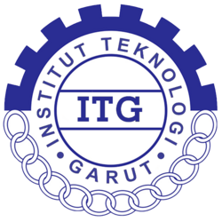

<div align="center">
  
  <h1 align="center">LMS Landing Page</h1>
  <p align="center">
    Institut Teknologi Garut
    <br />
    Platform pembelajaran digital — pintu masuk utama menuju sistem LMS kampus
  </p>
  <p>
    
    
    
    
    
  </p>
</div>

---

## Daftar Isi

- [Tentang](#tentang)
- [Fitur](#fitur)
- [Tech Stack](#tech-stack)
- [Struktur Proyek](#struktur-proyek)
- [Cara Menjalankan](#cara-menjalankan)
- [Halaman](#halaman)
- [Warna](#warna)
- [Lisensi](#lisensi)

---

## Tentang

Landing page untuk sistem **LMS (Learning Management System)** Institut Teknologi Garut. Halaman ini menjadi pintu masuk pertama bagi mahasiswa, calon mahasiswa, dosen, dan pengunjung umum sebelum masuk ke sistem pembelajaran, sekaligus menjadi media informasi mengenai program studi dan pengumuman kampus.

### Tujuan

- Menyediakan akses cepat menuju LMS bagi mahasiswa dan dosen
- Memperkenalkan program studi yang tersedia
- Menyampaikan pengumuman kampus secara terpusat
- Mendukung aksesibilitas dwibahasa (Indonesia & Inggris)
- Membangun citra digital kampus yang modern dan profesional

---

## Fitur

| Fitur | Keterangan |
|---|---|
| 🌐 **Landing Page** | 4 section: Navigasi, Hero, Program Studi (bento grid), Footer |
| 🌍 **Dwibahasa** | Indonesia & Inggris, toggle via tombol header (session, default ID) |
| 🔐 **Halaman Login** | Route `/login` dengan form validasi, toggle password, remember me |
| 📱 **Responsif** | Desktop, tablet, dan mobile (breakpoint 1440/1024/768/375) |
| 🎬 **Animasi Scroll** | Fade-in + translate saat elemen masuk viewport (IntersectionObserver) |
| 🎨 **Pattern Grid** | Dekorasi kotak-kotak halus di Hero & Login Page |
| 🖱️ **Smooth Scroll** | Anchor link navigasi scroll halus ke section |
| ♿ **Aksesibilitas** | Navigasi keyboard, alt text, kontras warna |
| 🔤 **Font Modern** | Space Grotesk (heading), DM Sans (body) |

---

## Tech Stack

### Frontend

| Bagian | Teknologi |
|---|---|
| **Framework** | React 19 |
| **Build Tool** | Vite 8 |
| **Bahasa** | TypeScript 6 |
| **UI Library** | shadcn/ui (Radix UI primitives) |
| **Styling** | Tailwind CSS v4 + tw-animate-css |
| **Routing** | React Router v7 |
| **i18n** | react-i18next |

### Arsitektur

```
[React + Vite + shadcn/ui]  <-- REST API (JSON) -->  [Node.js/Express]  <-->  [MySQL]
        (Frontend)                                       (Backend)          (Database)
```

> **Catatan:** Backend Express + MySQL belum diimplementasikan. Data program studi dan pengumuman masih dummy.

---

## Struktur Proyek

```
lms-itg-v2/
├── frontend/
│   ├── public/
│   │   └── favicon.png
│   ├── src/
│   │   ├── assets/
│   │   │   ├── prodi/              # Gambar program studi (5 prodi)
│   │   │   ├── hero.png
│   │   │   └── logo-itg.png
│   │   ├── components/
│   │   │   ├── ui/                 # shadcn/ui components
│   │   │   │   ├── accordion.tsx
│   │   │   │   ├── button.tsx
│   │   │   │   ├── card.tsx
│   │   │   │   ├── dialog.tsx
│   │   │   │   ├── dropdown-menu.tsx
│   │   │   │   ├── input.tsx
│   │   │   │   ├── label.tsx
│   │   │   │   ├── navigation-menu.tsx
│   │   │   │   ├── separator.tsx
│   │   │   │   ├── sheet.tsx
│   │   │   │   └── tabs.tsx
│   │   │   ├── Navbar.tsx          # + AnnouncementDrawer
│   │   │   ├── Hero.tsx
│   │   │   ├── ProgramStudi.tsx    # Bento grid
│   │   │   ├── Faq.tsx             # Accordion + contact card
│   │   │   ├── Footer.tsx          # 3 kolom + sosial media
│   │   │   ├── Logo.tsx
│   │   │   └── LanguageSwitcher.tsx
│   │   ├── hooks/
│   │   │   └── use-in-view.ts
│   │   ├── pages/
│   │   │   └── LoginPage.tsx
│   │   ├── i18n/
│   │   │   ├── id.json
│   │   │   ├── en.json
│   │   │   └── index.ts
│   │   ├── lib/
│   │   │   └── utils.ts
│   │   ├── App.tsx
│   │   ├── main.tsx
│   │   └── index.css
│   ├── index.html
│   ├── package.json
│   ├── vite.config.ts
│   ├── components.json
│   └── tsconfig*.json
├── PRD_LMS_Institut_Teknologi_Garut.md
└── README.md
```

---

## Cara Menjalankan

### Prasyarat

- Node.js v24+
- npm 12+

### Instalasi & Development

```bash
# Clone repositori
git clone https://github.com/username/lms-itg-v2.git
cd lms-itg-v2/frontend

# Install dependencies
npm install

# Jalankan development server
npm run dev

# Build production
npm run build

# Preview hasil build
npm run preview
```

Server dev akan berjalan di `http://localhost:5173`.

---

## Halaman

| Route | Halaman | Deskripsi |
|---|---|---|
| `/` | Landing Page | Hero, Program Studi, FAQ, Footer |
| `/login` | Login Page | Form autentikasi (demo) |

---

## Warna

Skema warna berdasarkan logo Institut Teknologi Garut:

| Token | Warna | Hex | Penggunaan |
|---|---|---|---|
| Primary | 🟦 Biru Logo | `#383B97` | Tombol utama, aksen, gradient |
| Primary Light | 🔵 Biru Medium | `#5660BC` | Ikon, hover, ring |
| Background | ⬜ Putih | `#FFFFFF` | Latar utama |
| Muted | 🌫️ Abu Netral | `oklch(0.968 0.001 286.375)` | Section FAQ, background kartu |
| Muted Foreground | 🌫️ Abu Teks | `oklch(0.556 0.016 285.938)` | Teks sekunder, deskripsi |

---

## Lisensi

© 2026 Institut Teknologi Garut. Seluruh hak cipta dilindungi.

---

<div align="center">
  <sub>Dibangun dengan ❤️ oleh Tim Digital ITG</sub>
</div>